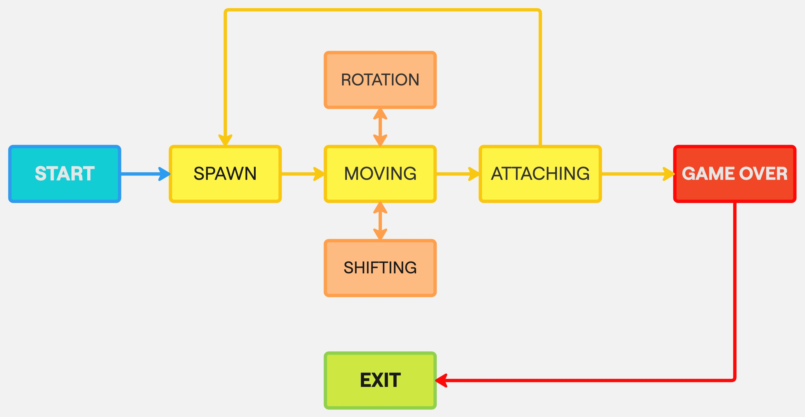

\mainpage
> Для работы десктопного интерфейса требуется установить QT:
> - `macOS` - `brew install qt`
> - `Ubuntu/Debian` - `sudo apt install qt6-base-dev -y && sudo apt install qmake6 -y`

# Тетрис
## Реализация игры «Тетрис» на языке С
## Проект состоит из двух частей:
- библиотеки, реализующей логику работы игры
- терминального интерфейса
> Библиотека также поддерживает десктопный интерфейс из [Змейки](#змейка)

## Цель игры
Цель игры — в наборе очков за построение линий из генерируемых игрой блоков. Очередной блок, сгенерированный игрой, начинает опускаться вниз по игровому полю, пока не достигнет нижней границы или не столкнется с другим блоком. Пользователь может поворачивать фигуры и перемещать их по горизонтали, стараясь составлять ряды. После заполнения ряд уничтожается, игрок получает очки, а блоки, находящиеся выше заполненного ряда, опускаются вниз. Игра заканчивается, когда очередная фигура останавливается в самом верхнем ряду
## Логика работы игры реализована с использованием конечных автоматов:

- `START` - начало игры
- `SPAWN` - размещение фигуры на поле
- `MOVING` - перемещение фигуры (вправо-влево-вниз до конца)
- `SHIFTING` - смещение на одну клетку вниз по истечении игрового таймера
- `ROTATION` - поворот вокруг своей оси
- `ATTACHING` - прикрепление фигуры при столкновении с границей поля или с другой фигурой. Далее переходит в состояние `SPAWN` или `GAME OVER`
- `GAME OVER` - конец игры; возникает в случае, когда новая фигура сталкивается с прошлой сразу после размещения
- `EXIT` - выход из игры

## Используемые фигуры:

## Управление:
- `T` - начало игры
- `P` - пауза
- `ESC` или `Q` - завершение игры
- `←` — движение фигуры влево
- `→` — движение фигуры вправо
- `↓` — падение фигуры
- `SPACE` или `↑` — вращение фигуры

## Очки начисляются за уничтожение линий:
- 1 линия — 100 очков
- 2 линии — 300 очков
- 3 линии — 700 очков
- 4 линии — 1500 очков

## Механика уровней
Каждый раз, когда игрок набирает 600 очков, уровень увеличивается на 1. Повышение уровня увеличивает скорость движения фигур. Максимальное количество уровней — 10

# Змейка
## Реализация игры «Змейка» на языке программирования С++ в парадигме объектно-ориентированного программирования
## Проект состоит из двух частей:
- библиотеки, отвечающей за реализацию логики игры
- десктопного графического интерфейса
> Библиотека также поддерживает консольный интерфейс из [Тетриса](#тетрис)

## Цель игры
Игрок управляет змейкой, которая непрерывно движется вперед. Игрок изменяет направление движения змейки с помощью стрелок. Цель игры заключается в сборе яблок, появляющихся на игровом поле. При этом игрок не должен касаться стенок игрового поля или хвоста змейки. После поедания очередного яблока длина змейки увеличивается на один. Игрок побеждает, если змейка достигает максимального размера (200 пикселей). Если змейка сталкивается с границей игрового поля или своим хвостом, то игрок проигрывает
## Логика работы игры реализована с использованием конечных автоматов:

- `START` - начало игры
- `SPAWN` - размещение яблока и змейки на поле. Змейка находится в состоянии `SPAWN` только при старте игры, во время игры `SPAWN` применим только к яблоку
- `MOVING` - перемещение змейки по полю
- `SHIFTING` - смещение змейки на одну клетку по истечении игрового таймера
- `ROTATION` - поворот (вправо-влево)
- `ATTACHING` - съедение яблока или столкновение со своим телом или границами. Далее переходит в состояние `SPAWN` (если яблоко съедено) или `GAME OVER` (если произошло столкновение со своим телом или границами)
- `GAME OVER` - конец игры; возникает в случае столкновения змейки со своим телом или границами или при желании игрока окончить игру
- `EXIT` - выход из игры

## В игре используется паттерн MVC:

Паттерн MVC (Model-View-Controller, Модель-Представление-Контроллер) представляет собой схему разделения модулей приложения на три отдельных макрокомпонента: модель, содержащую в себе бизнес-логику, представление — форму пользовательского интерфейса для осуществления взаимодействия с программой и контроллер, осуществляющий модификацию модели по действию пользователя.

Модель хранит и осуществляет доступ к основным данным, производит по запросам операции, определенные логикой игры, то есть руководит той частью программы, которая отвечает за все алгоритмы и процессы обработки информации. Данные модели, изменяясь под действием контроллера, влияют на отображение информации на представлении пользовательского интерфейса. В качестве модели в Змейке выступает библиотека классов, осуществляющая логику игры. Эта библиотека предоставляет все необходимые классы и методы для осуществления механики игры.

Контроллер — компонент, который осуществляет модификацию модели. В коде это выглядит, как набор методов, которые работают напрямую с моделью. Контроллер выполняет функцию связующего элемента между интерфейсом и моделью. Это позволяет полностью отделить модель от отображения.

К представлению относится весь код, связанный с интерфейсом программы. В коде интерфейса нет никакой бизнес-логики. Он только представляет форму для взаимодействия с пользователем. Взаимодействуя с интерфейсом, пользователь вызывает методы контроллера, которые модифицируют модель

## Управление:
- `S` - начало игры
- `P` - пауза
- `ESC` или `Q` - завершение игры
- Стрелки `←`, `→`, `↑`, `↓` — управление движением змейки Если движение осуществляется по-вертикали (ось Y) для поворота используются клавиши лево-право, если движение по-горизонтали (ось Х) - клавиши вверх-вниз. Для ускорения используется клавиша соответствующая направлению движения, обратная направлению клавиша не используется

## Очки начисляются за съедение яблока:
Когда змейка съедает яблоко, ее длина увеличивается на один и на одно очко увеличивается игровой счёт

## Механика уровней
Каждый раз, когда игрок набирает 5 очков, уровень увеличивается на 1. Повышение уровня увеличивает скорость движения змейки. Максимальное количество уровней — 10